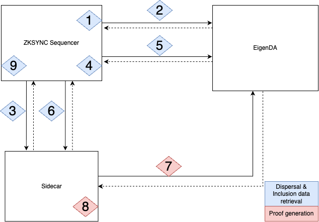

# Design

M1 consists of checking the inclusion of the blob and verifying that the data that is committed to is the correct one, this computations would be too heavy/costly to run directly on chain. An offchain implementation is needed in order to prevent this high costs. We resolve this by making a binary capable of running this checks in a provable way.

# Integration

The important components are marked in **bold**

## Step 1: Sequencer Dispersal and Inclusion data retrieval (Marked in Blue) & Sidecar Proof Generation (Marked in red)



1. Zksync's sequencer finishes a batch and wants to disperse its content (**Blob Data**).
2. Zksync's sequencer sends the blob to be dispersed to EigenDA, EigenDA returns the **Blob Key**.
3. Zksync's sequencer sends the **Blob key** to the Sidecar.
4. Zksync's sequencer stores the **Blob Key** in its database.
5. Zksync’s sequencer asks for **Inlcusion Data** (encoded **EigenDACert**) to EigenDA.
6. Zksync’s sequencer starts waiting for Sidecar **Blob Key** proof to be generated.
7. Sidecar asks EigenDA for **EigenDACert** and **Blob Data** (this step runs parallel to step 4)
8. Sidecar executes Risc0, doing 3 things:
    a. Call to checkDACert
    b. Proof of Equivalence
    c. Calculation of **EigenDAHash** (keccak of *BlobData*)
    
    And generates a **Risc0 Proof** of those 3 things.
    
9. Zksync’s sequencer finishes waiting for proof (step 6), storing the retrieved proof in its database. It then calls the Commit Batches function of Executor (zksync’s DiamondProxy implementation)on Ethereum.

## Step 2 Commit Batches (Marked in Green)

Everything here runs on Ethereum


1. Executor starts commit batches function.
2. Executor calls the EigenDAL1DAValidator checkDA function with **l2DAValidatorOutputHash** and **operatorDAInput** as parameter
    1. **l2DAValidatorOutputHash**: keccak(**stateDiffHash** + **EigenDAHash**)
    2. **operatorDAInput**: **StateDiffHash** + **Inclusion Data** (seal + imageId + journalDigest + eigenDAHash)
    
    💡 (**stateDiffHash** is the hash of the states diffs, calculated on EigenDAL2Validator and sent to L1 through L2→L1 Logs)
    
3. EigenDAL1DAValidator calls risc0Verifier `verify` function with **inclusionData.seal**, **inclusionData.imageId**, **inclusionData.journalDigest** as parameters, which is expected to **not revert** upon succesful verification.
4. EigenDAL1DAValidator checks if keccak(**stateDiffHash** + **inclusionData.EigenDAHash**) equals **l2DAValidatorOutputHash** (meaning that if not, **EigenDAHash** was not correctly calculated by the sidecar).


# What does the Guest do?

There are 3 things we want to achieve with the Risc0 guest. Each one of them is addressed in point 8.

1. We want to check that the blob is available in EigenDA. 8.a
2. We want to check that the commitment commits to that blob. 8.b
3. We want to check that the blob is the same we dispersed on zksync. 8.c

## Call to checkDACert (8.a)

On the host:

Inputs: `rpc_url`, `cert_verifier_router_addr`

```rust
    let call = IVerifyBlob::checkDACertCall {
        eigendacert: eigenda_cert.to_abi_encoded()?.into(),
    };

    // Create an EVM environment from an RPC endpoint defaulting to the latest block.
    let mut env = EthEvmEnv::builder()
        .rpc(rpc_url.clone())
        .chain_spec(&ETH_HOLESKY_CHAIN_SPEC)
        .build()
        .await?;

    // Preflight the call to prepare the input that is required to execute the function in
    // the guest without RPC access. It also returns the result of the call.
    // Risc0 steel creates an ethereum VM using revm, where it simulates the call to checkDACert.
    // So we need to make this preflight call to populate the VM environment with the current state of the chain
    let mut contract = Contract::preflight(cert_verifier_router_addr, &mut env);
    let returns = contract.call_builder(&call).call().await?;
    tracing::info!(
        "Call {} Function on {:#} returns: {}",
        IVerifyBlob::checkDACertCall::SIGNATURE,
        cert_verifier_router_addr,
        returns
    );

    // Finally, construct the input from the environment.
    let input = env.into_input().await?;
```

We make the preflight call to `CertVerifierRouter` to populate the EvmEnv

Output: input (EthEvmInput type)

On the guest:

Inputs: input

```rust
    // Read the input from the guest environment.
    let input: EthEvmInput = env::read();

    // Converts the input into a `EvmEnv` for execution.
    let env = input.into_env(&ETH_HOLESKY_CHAIN_SPEC);

    
    // Execute the view call; it returns the result in the type generated by the `sol!` macro.
    let contract = Contract::new(cert_verifier_router_addr, &env);
    let call = IVerifyBlob::checkDACertCall {
        eigendacert: eigenda_cert.to_abi_encoded().unwrap().into(),
    };
    let returns = contract.call_builder(&call).call();
    
    // Here we assert that the result of the checkDACert call is succesfull
    let status = CheckDACertStatus::try_from(returns).unwrap();

    assert_eq!(
        status,
        CheckDACertStatus::Success,
        "CheckDACert call failed"
);
```

Here we make the call to checkDACert inside the risc0 steel VM.

What risc0 steel does is, given the env it generates a revm VM with the given state of the chain.

And it simulates the call to the contract.

We then assert the result of that call being sucessfull.

Outputs: **Risc0Proof**

#### Proof Of Equivalence (8.b)

On the host:

Inputs: **EigenDACert, BlobData,** SRSPoints

```rust
    let blob = Blob::new(&encoded_data);

    let mut kzg = KZG::new();

    kzg.calculate_and_store_roots_of_unity(blob.len().try_into()?)?;

    let cert_commitment = eigenda_cert
        .blob_inclusion_info
        .blob_certificate
        .blob_header
        .commitment
        .commitment;
```

First we obtain the commitment from the EigenDACert’s blob header:

```rust
    // Calculate the polynomial in evaluation form
    let poly_coeff = blob.to_polynomial_coeff_form();
    let poly_eval = poly_coeff.to_eval_form()?;

    let evaluation_challenge = compute_challenge(&blob, &cert_commitment)?;

    // Compute the proof that the commitment corresponds to the given blob
    let proof = kzg.compute_proof(&poly_eval, &evaluation_challenge, &srs)?;
```

We then calculate the eval polynomial, the evaluation challenge and the proof for that commitment

Output: Proof

Guest:

Inputs: **BlobData**, Proof, EigenDACert (commitment)

```rust
    // Calculate the polynomial in evaluation form
    let poly_coeff = blob.to_polynomial_coeff_form();
    let poly_eval = poly_coeff.to_eval_form().unwrap();

    // Get the commitment from eigenda cert
    let cert_commitment = eigenda_cert.blob_inclusion_info.blob_certificate.blob_header.commitment.commitment;
    // Compute evaluation challenge
    let evaluation_challenge = compute_challenge(&blob, &cert_commitment).unwrap();

    // Evaluate the polynomial at the evaluation challenge
    let y = evaluate_polynomial_in_evaluation_form(&poly_eval, &evaluation_challenge).unwrap();

    let evaled_y = eval(poly_coeff.coeffs(), evaluation_challenge);

    // Assert that the evaluation of the polynomial at the evaluation challenge is equal to the y value
    assert_eq!(y, evaled_y);

    // Verification of the kzg proof for the given commitment, evaluation and evaluation challenge
    let verified = verify_proof(cert_commitment, proof.g1, y, evaluation_challenge).unwrap();
    assert!(verified);
```

We recalculate the evaluation polynomial, the cert commitment from the blob info and the evaluation challenge.
Then we get the evaluation at the challenge point and compare it to the one we calculate using horner's rule.
Then we verify the proof for the commitment at that challenge point

Output: **Risc0Proof**

#### EigenDAHash (8.c)

In the guest we also calculate the eigenDAHash

```rust
    // Here we calculate the keccak hash of the data, which we will use on zksync's EigenDAL1Validator to compare it to the hashes there
    let hash = keccak256(&data);

    let mut proof_bytes = vec![];
    proof.g1.serialize_compressed(&mut proof_bytes).unwrap();
    // Public outputs of the guest, eigenDAHash, commitment to the risc0 steel environment, blob info and proof, they are embedded on the risc0 proof
    let output = Output {
        hash: hash.to_vec(),
        env_commitment: env.commitment().abi_encode(),
        inclusion_data: eigenda_cert.to_bytes().unwrap(),
        proof: proof_bytes,
    };
```

And return it as a public output.

We then store this proof on the sidecar database.

Then on zksync’s `EigenDAL1DAValidator`, we check the validity of this proof by verifying against the `risc0verifier`, and compare the hash against the one calculated there.

The idea of the hash check is to make sure that the blob we verified on the guest is the same blob we dispersed on zksync.

